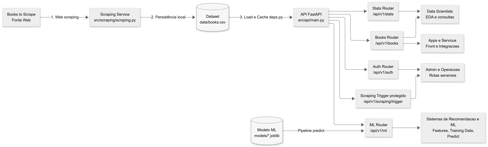

# 📚 Books Analytics & ML API  
**Tech Challenge – Pós Tech | Machine Learning Engineering (Fase 1)**

## 📌 Visão Geral

Este projeto implementa uma **API pública RESTful** para coleta, processamento, análise e disponibilização de dados de livros, utilizando como fonte o site **Books to Scrape**.

A solução foi desenvolvida como parte do **Tech Challenge da Pós Tech**, contemplando um **pipeline completo de dados**, desde **web scraping**, armazenamento estruturado, **análises estatísticas**, até **preparação e consumo de dados para Machine Learning**, incluindo **predição de avaliação de livros**.

A API foi construída com **FastAPI**, seguindo boas práticas de organização, escalabilidade e documentação automática (Swagger).

---

## 🎯 Objetivos do Projeto

- Construir um **pipeline de dados end-to-end**
- Extrair dados via **web scraping**
- Disponibilizar os dados por meio de uma **API pública**
- Criar endpoints analíticos (insights)
- Preparar a base para **consumo por modelos de Machine Learning**
- Implementar **autenticação JWT** para rotas sensíveis
- Atender aos requisitos obrigatórios e bônus do Tech Challenge

---

## 🧱 Arquitetura



## 📁 Estrutura do Projeto

```bash
.
├── src/
│   └── book_api/
│       ├── __init__.py
│       ├── api/
│       │   ├── __init__.py
│       │   ├── main.py
│       │   ├── deps.py
│       │   ├── core/
│       │   │   ├── __init__.py
│       │   │   └── settings.py
│       │   └── routers/
│       │       ├── __init__.py
│       │       ├── auth.py
│       │       ├── books.py
│       │       ├── categories.py
│       │       ├── health.py
│       │       ├── stats.py
│       │       ├── scraping.py
│       │       └── ml.py
│       ├── auth/
│       │   ├── __init__.py
│       │   └── authentication.py
│       ├── features/
│       │   ├── __init__.py
│       │   └── extract_features.py
│       ├── schema/
│       │   ├── __init__.py
│       │   └── predict_request.py
│       ├── scripts/
│       │   ├── __init__.py
│       │   └── data_analysis.py
│       └── scraping/
│           ├── __init__.py
│           └── scraping.py
├── data/
│   └── books.csv
├── models/
│   └── modelo_avaliacao_books.joblib
├── docs/
│   ├── auth.md
│   ├── books.md
│   ├── ml.md
│   └── stats.md
├── .env.example
├── requirements.txt
└── README.md
```


## ⚙️ Tecnologias Utilizadas

- Python 3.10+
- FastAPI
- Pandas / NumPy
- Scikit-learn
- Joblib
- JWT Authentication
- BeautifulSoup / Requests
- Swagger / OpenAPI

## 🚀 Instalação e Execução

### 1️⃣ Clonar o repositório
```bash
git clone https://github.com/seu-usuario/books-analytics-ml-api.git
cd books-analytics-ml-api
```

### 2️⃣ Criar ambiente virtual
```bash
python -m venv .venv
source .venv/bin/activate  # Linux / Mac
.venv\Scripts\activate     # Windows
```

### 3️⃣ Instalar dependências
```bash
pip install -r requirements.txt
```

### 4️⃣ Executar a API localmente
```bash
uvicorn scr.api.main:app --reload
```

Após iniciar a aplicação, os seguintes endpoints estarão disponíveis:

📘 Swagger (documentação interativa)
http://localhost:8000/docs

📕 Redoc
http://localhost:8000/redoc


## 🔐 Autenticação (JWT)
POST /api/v1/auth/login

Endpoint responsável por autenticar o usuário e retornar os tokens JWT.

Request (x-www-form-urlencoded)

```bash
username=admin
password=admin123
```

Response
```bash
{
  "access_token": "jwt_access_token",
  "refresh_token": "jwt_refresh_token",
  "token_type": "bearer"
}
```

O access_token deve ser enviado no header das requisições protegidas:
```bash
Authorization: Bearer <access_token>
```

## 📚 Endpoints da API

### 📘 Books

- **GET** `/api/v1/books`  
  Retorna todos os livros disponíveis.

- **GET** `/api/v1/books/{id}`  
  Retorna os detalhes de um livro específico pelo índice.

- **GET** `/api/v1/books/search?title=&category=`  
  Busca livros por título e/ou categoria.

- **GET** `/api/v1/books/top-rated`  
  Lista os livros com melhor avaliação.

- **GET** `/api/v1/books/price-range?min=&max=`  
  Filtra livros dentro de uma faixa de preço.

---

### 🗂 Categories

- **GET** `/api/v1/categories`  
  Lista todas as categorias disponíveis.

---

### ❤️ Health

- **GET** `/api/v1/health`  
  Verifica o status da API e a integridade dos dados carregados.

---

### 📊 Stats & Insights

- **GET** `/api/v1/stats/overview`  
  Estatísticas gerais da coleção (quantidade de livros, preço médio, distribuição de avaliações).

- **GET** `/api/v1/stats/categories/{category}`  
  Estatísticas detalhadas para uma categoria específica.

---

### 🕷 Scraping (Admin)

- **POST** `/api/v1/scraping/trigger`  
  Executa o processo de web scraping e atualiza o dataset.

> ⚠️ Endpoint protegido por autenticação JWT.

---

### 🤖 Machine Learning

- **GET** `/api/v1/ml/features`  
  Retorna os dados formatados para uso como features em modelos de ML.

- **GET** `/api/v1/ml/training-data`  
  Retorna conjuntos de treino e teste prontos para treinamento.

- **POST** `/api/v1/ml/predict`  
  Realiza a predição da avaliação de um livro.

#### Exemplo de Request
```json
{
  "preco": 25.99,
  "disponibilidade": 1,
  "categoria": "Science"
}
```

## 🌐 Deploy

🔗 Link da API em produção 
https://books-analytics-ml-api.onrender.com/docs

## 🎥 Vídeo de Apresentação

🎬 Link do vídeo